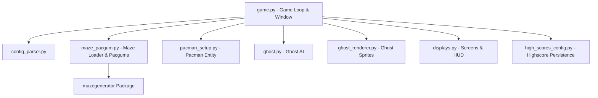

*This activity has been created as part of the 42 curriculum by aalrousa, ybarakat.*

# Pac-Man

## Description

This project is an object-oriented recreation of the classic 1980 arcade game **Pac-Man**, implemented in Python using Pygame and an external maze generator package. The goal of the game is to navigate Pac-Man through randomly generated maze corridors, eat all the Pacgums while dodging chasing ghosts, and score maximum points before running out of lives or time.

The project demonstrates modular software architecture, robust error handling, JSON configuration parsing, dynamic sprite rendering, state-driven ghost AI, and automated build/linting via a `Makefile`.

---

## Instructions

### Prerequisites
- **Python**: Version 3.10 or later
- **Dependencies**: `pygame`, `flake8`, `mypy`

### Installation & Setup
To install project dependencies, run:
```bash
make install
```

### Running the Game
To launch the Pac-Man game with a configuration file:
```bash
make run
# Or directly via Python:
python3 game.py config.json
```

### Debugging
To launch the game in debug mode using Python's built-in debugger (`pdb`):
```bash
make debug
```

### Code Formatting & Static Analysis
To run static type checking (`mypy`) and code style enforcement (`flake8`):
```bash
make lint
```

### Cleaning Up
To remove temporary Python cache directories (`__pycache__`, `.mypy_cache`, `.pyc` files):
```bash
make clean
```

---

## Configuration

Game parameters are configured via a standard JSON file (e.g., `config.json`) which supports line comments starting with `#`.

### Config Schema & Defaults
| Parameter | Type | Default | Description |
|---|---|---|---|
| `highscore_filename` | `str` | `"pc.json"` | Path to persistent highscore JSON file |
| `levels` | `list[dict]` | 10x `{"width": 20, "height": 15}` | Per-level maze size in cells; width clamped to 15-30, height to 11-24 |
| `lives` | `int` | `3` | Initial number of Pac-Man lives |
| `pacgum` | `int` | `42` | Number of pacgums placed in maze |
| `points_per_pacgum` | `int` | `10` | Score awarded for eating a small Pacgum |
| `points_per_super_pacgum` | `int` | `50` | Score awarded for eating a Super-pacgum |
| `points_per_ghost` | `int` | `200` | Score awarded for eating a vulnerable ghost |
| `seed` | `int` | `42` | Seed for fixed level 1 maze generation |
| `level_max_time` | `int` | `90` | Time limit per level in seconds |

Invalid or missing configuration keys fall back cleanly to safe defaults without throwing Python tracebacks.

---

## Highscore

The highscore module provides a persistent highscore system saved in JSON format on disk:
- **Persistence**: Highscores are loaded from the file named by `highscore_filename` in the config (default `pc.json`) when the menu is shown, and updated when a run ends.
- **Validation**: Player names are capped at 10 characters (alphanumeric characters and spaces only). Negative or non-integer scores are rejected.
- **Top 10 Rankings**: The system retains only the top 10 scores sorted descending.
- **Implementation Rationale**: Storing highscores as structured JSON allows simple file parsing, easy inspection during peer evaluations, and robust error handling against corrupt or missing files.

---

## Maze Generation

Maze levels are generated using the external `A-Maze-ing` package (`mazegenerator`):
- **Package Integration**: Integrated directly via `maze_pacgum.py`'s `maze_loader()` through the `MazeGenerator` class without modifying the external package interface.
- **Seed Progression**: Level 1 uses the seed from `config.json` (`seed`, default `42`), giving a reproducible first maze. Every level switch after that (`switch_level()`) currently regenerates with a fixed seed of `0`, so later levels are also reproducible rather than randomized.
- **Wall Encoding**: Maze cells return bitmask integers (`0x1` Top, `0x2` Right, `0x4` Bottom, `0x8` Left, `0xF` Solid Wall), which `maze_pacgum.py` and `ghost.py` inspect for movement validation.

---

## Implementation

The project is structured into modular Python source files:
- **`game.py`**: Entry point and Pygame main loop. Handles display updates, tick timing, HUD rendering, keyboard/mouse input, and collision checking.
- **`config_parser.py`**: Strips `#` comment lines from JSON files and validates configuration types (including per-level `levels` entries) against default schemas.
- **`constants.py`**: Shared rendering constants (`CELL_SIZE`) used across the maze, pacman, and game modules.
- **`maze_pacgum.py`**: Interoperates with `MazeGenerator`, loads maze grid arrays, and handles `Pacgum`/`SuperPacgum` placement and maze/pacgum drawing.
- **`pacman_setup.py`**: Defines the `Pacman` class managing grid coordinates, lives, movement direction, score, and directional animation frames.
- **`ghost.py`**: Defines the `Ghost` AI entity, which tracks its own `state` (`"chasing"`, `"escape"`, or `"respawn"`) as a plain string. Chasing uses BFS pathfinding along valid corridors; view range and escape target selection use Manhattan distance.
- **`ghost_renderer.py`**: Manages loading and dynamic scaling of ghost PNG sprite assets (`blinky`, `pinky`, `inky`, `clyde`, `blue_ghost`).
- **`displays.py`**: Draws every screen (menu, instructions, high scores, cheat panel, pause submenu, name entry, HUD) onto the shared game surface.
- **`high_scores_config.py`**: Loads, saves, and updates the persistent top-10 highscore JSON list.

---

## General Software Architecture



### Module Responsibilities & Coupling
- **Decoupled Graphics**: `ghost_renderer.py` abstracts sprite rendering away from `ghost.py` logic, allowing state updates and rendering to remain independent.
- **Event-Driven Movement**: Keypresses update `Pacman.cur_dir`, which is evaluated on every movement tick against `maze['grid']` wall bitmasks.
- **Robust Exception Handling**: File reads, image loading, and external package calls are wrapped in `try-except` blocks to prevent unhandled tracebacks.

---

## Project Management

Project management documentation, progress tracking, risk assessment, and peer evaluation acceptance test plans are documented in the dedicated `project_management/` directory.

- Link to directory: [project_management/](project_management/)

---

## Resources

### References & Documentation
- [Pygame Documentation](https://www.pygame.org/docs/) — Pygame graphical library references and event handling.
- [PEP 8 Style Guide for Python Code](https://peps.python.org/pep-0008/) — Code formatting standards enforced via `flake8`.
- [PEP 257 Docstring Conventions](https://peps.python.org/pep-0257/) — Documentation standard for Python modules and methods.
- [Pac-Man Game Mechanics](https://pacman.fandom.com/wiki/Pac-Man_Wiki) — Insights on arcade ghost AI behaviors and scoring mechanics.

### AI Usage Statement
Artificial Intelligence tools were utilized during the development of this project to:
- Assist in optimizing grid rendering offsets and sprite scaling math across varying display resolutions.
- Refactor conditional statements to meet strict PEP 8 and `flake8` line length requirements.
- Generate structured documentation templates and architectural summaries.
